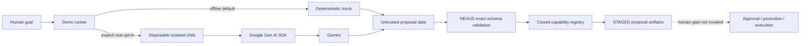

# Architecture

## Authority boundary

Gemini is a proposal producer. It can generate mission content but cannot
alter the authority boundary around that content.

NEXUS/Keeper owns:

- process isolation, deadline enforcement, and cancellation;
- independent model-identity comparison;
- exact response-schema validation;
- closed-world capability selection;
- deterministic mission identifiers and generation hashes;
- durable proposal staging;
- the separate human approval boundary.

The demo never invokes the dotted final edge. A successful result is
`STAGED`, not `APPROVED`, `PROMOTED`, or `EXECUTED`.

> **The mission can evolve. Its authority cannot silently change.**

