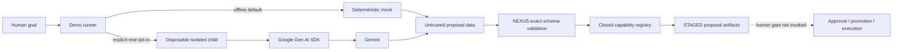
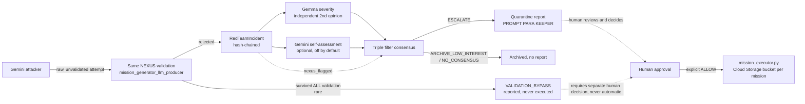

# Architecture

## Authority boundary

Gemini is a proposal producer. It can generate mission content but cannot
alter the authority boundary around that content.

NEXUS/Keeper owns:

- process isolation, deadline enforcement, and cancellation;
- independent model-identity comparison;
- exact response-schema validation;
- closed-world capability selection;
- deterministic mission identifiers and generation hashes;
- durable proposal staging;
- the separate human approval boundary.

The demo never invokes the dotted final edge. A successful result is
`STAGED`, not `APPROVED`, `PROMOTED`, or `EXECUTED`.

> **The mission can evolve. Its authority cannot silently change.**

## Red Team Module

A second, independent pipeline that adversarially tests the same authority
boundary described above instead of exercising it with a cooperative goal.
It reuses the validation path unmodified (`mission_generator_llm_producer` +
`mission_generator_candidates`) rather than duplicating it, so a red-team
finding is evidence about the real boundary, not about a parallel copy of it.

| Stage | Module | Role |
|---|---|---|
| M-1 | `red_team_attacker.py` | Generates one adversarial mission-proposal attempt via Gemini, unconstrained by schema, deliberately trying to escalate privileges, inject fake authority fields, spoof model identity, or exploit validator inconsistencies. Never parses, validates, or executes its own output. |
| M-2 | `red_team_incident.py` | Records the attempt plus Nexus's real verdict as a `RedTeamIncident`, hash-chained (domain-separated SHA-256, same convention as `mission_generator_llm_producer._generation_id`) to every prior incident in the session — tamper-evident, append-only. |
| M-3 | `gemma_severity_classifier.py` | An independent second opinion on severity (BAJO/MEDIO/ALTO), from a different model than the one that generated the attack, so no single model grades its own work. |
| M-5 | `consensus_gate.py` | Requires agreement among three independent signals — Nexus's own deterministic verdict, Gemini's (optional) self-assessment, and Gemma's severity — before anything reaches a human: `ESCALATE`, `ARCHIVE_LOW_INTEREST`, or `NO_CONSENSUS`. |
| M-4 | `quarantine_report_generator.py` | Renders the consolidated Markdown report for `ESCALATE` incidents only, including a template-built "PROMPT PARA KEEPER" corrective block per incident. Always states explicitly that Nexus applied no change and the recommendation needs human approval. |
| M-9 | `red_team_session.py` | Orchestrates M-1 through M-4 across N rounds without duplicating any of their logic (`run_red_team_session`). If an attempt survives the entire existing validation path — a real finding, not a simulated one — it is marked `VALIDATION_BYPASS` and reported, **never executed**. |
| M-6 | `mission_executor.py` | The only module in this repo that produces a real external effect (a Cloud Storage bucket per approved mission). Requires a pre-existing `AllowDecision`, cryptographically bound to the exact mission content — it never generates that decision itself, and a `VALIDATION_BYPASS` from M-9 is never wired to it automatically. |
| M-7a | `google_agentic_cloud_service.py` | `POST /redteam` and `GET /quarantine/<incident_id>` — HTTP surface for the above, code-complete but **not deployed** as part of this work; see the root README for the placeholder Cloud Run URL. |

**Authority boundary, extended:** an `ESCALATE` from the red team module is a
*notification*, never an action. `VALIDATION_BYPASS` is the module's most
serious possible finding — a real gap in the existing boundary — and it is
handled with *more* caution than a routine escalation, not less: it is
reported for explicit human review, and this module never wires it to M-6 on
its own. See `NIGHT_QUESTIONS.md` for the specific, dated design decisions
made while building this module (Gemma/Lyria model IDs, the consensus
tie-break rule, and why `/redteam` runs offline-only in this phase).

